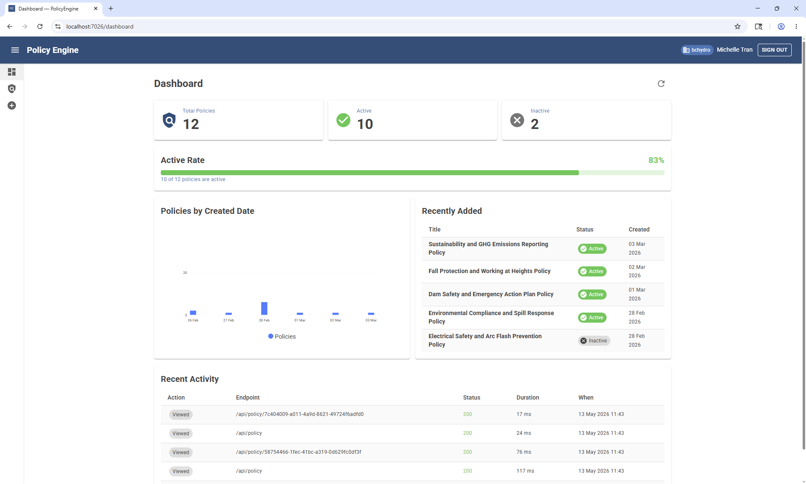
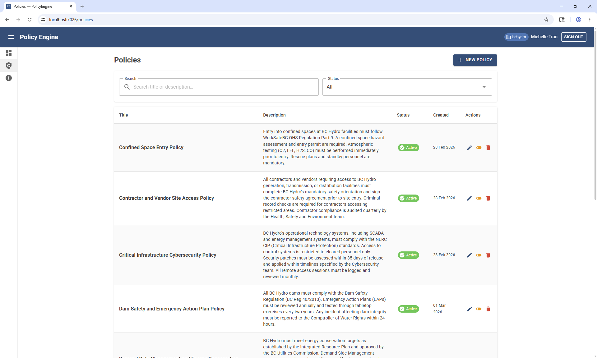
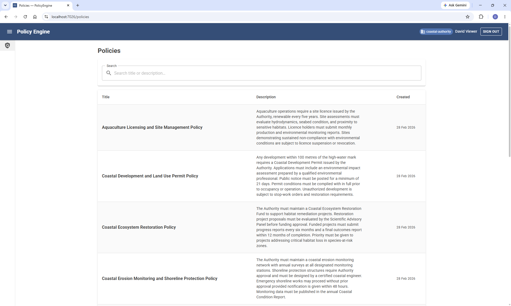
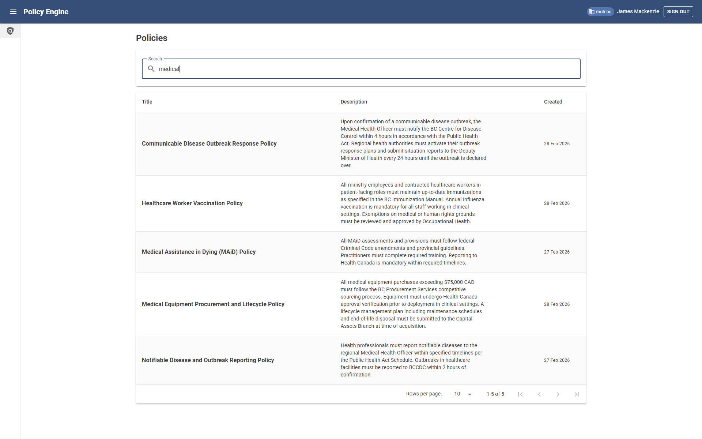
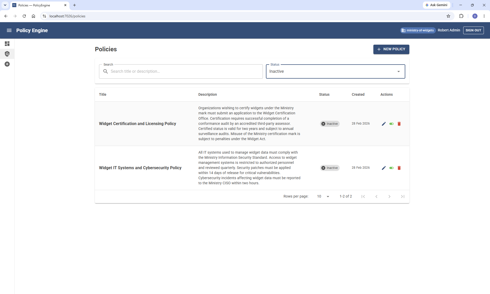
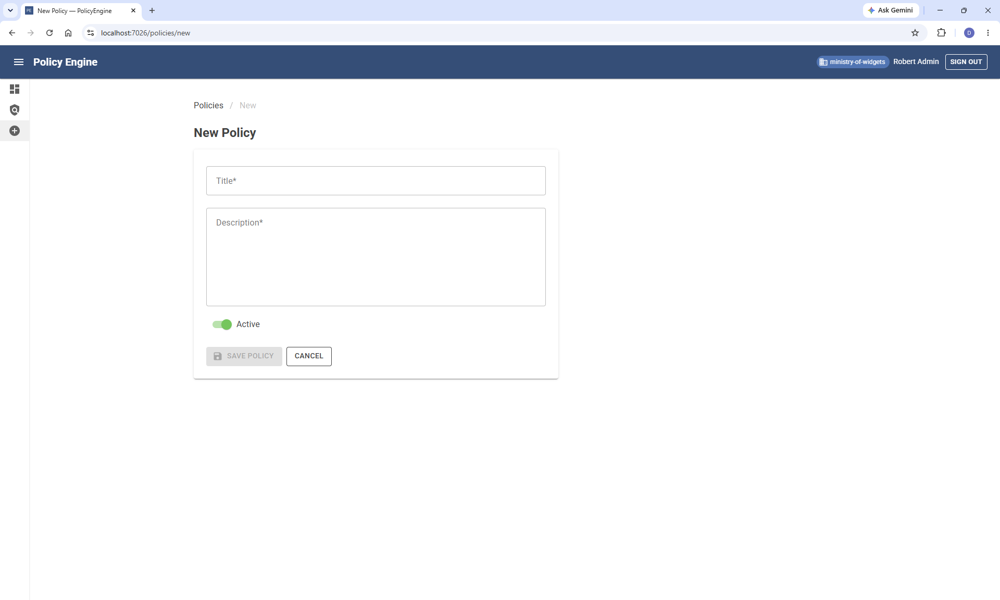
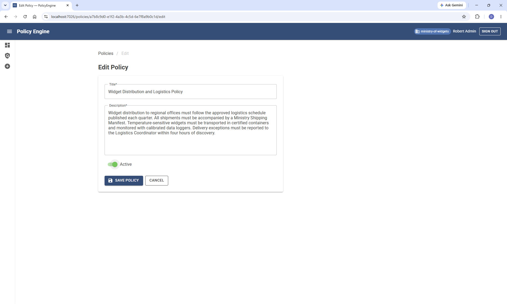

# PolicyEngine

A multi-tenant policy management system. PolicyEngine provides a Blazor WebAssembly frontend, a secured ASP.NET Core 10 API, Auth0-based authentication with role-based access control, and a full CI/CD pipeline deployed on Azure free-tier services.

## Tech Stack

| Layer | Technology |
|---|---|
| Frontend | Blazor WebAssembly |
| Backend | ASP.NET Core 10 Web API |
| Auth | Auth0 (JWT, RBAC) |
| Database | SQL Server / Azure SQL |
| Hosting | Azure App Service (F1) + Azure Static Web Apps |
| CI/CD | GitHub Actions |

## 📸 Screenshots

### Admin Dashboard
<p align="center">
  
</p>

The admin dashboard displays key policy metrics and recent activity at a glance. The Recent Activity section provides API endpoint metrics.

---

### Policies - Admin View
<p align="center">
  
</p>

All policies for the authenticated tenant are displayed with status badges and action buttons. Data is tenant-isolated — users only see policies belonging to their organization.

---

### Policies - Viewer View
<p align="center">
  
</p>

All policies for the authenticated tenant are displayed and searchable, but without status badges and action buttons.

---

### Search
<p align="center">
  
</p>

Policies can be filtered instantly by keyword. The search updates results in real time as you type.

---

### Status Filter
<p align="center">
  
</p>

Toggle between active and inactive policies using the status filter. Combined with search, this makes it easy to find exactly the policy you need.

---

### Create Policy
<p align="center">
  
</p>

Admins can create new policies through a simple form. This route is restricted to users with the `manage:policies` permission.

---

### Edit Policy
<p align="center">
  
</p>

Existing policies can be updated by admins. All changes are tracked with `CreatedBy` and `CreatedAt` shadow properties for full auditability.

## Project Structure

```
PolicyEngine/
├── PolicyEngine.Api/           # ASP.NET Core 10 Web API — JWT auth, role enforcement, CORS, CRUD endpoints
├── PolicyEngine.Authorization/ # Core authorization logic and policy evaluation
├── PolicyEngine.Persistence/   # EF Core DbContext, repositories, migrations, shadow properties
├── PolicyEngine.Shared/        # Shared entities, DTOs, and interfaces
├── PolicyEngine.Tests/         # xUnit unit and integration tests
├── PolicyEngine.Web/           # Blazor WebAssembly frontend — OIDC auth via Auth0, policy pages
└── .github/workflows/          # GitHub Actions CI/CD pipelines
```

## Architecture

PolicyEngine follows a clean three-tier architecture with identity delegated to Auth0:

```
[Blazor WASM]  →  (Bearer JWT)  →  [ASP.NET Core API]  →  [Azure SQL]
     ↑                                      ↑
  Azure Static                          App Service F1
  Web Apps (CDN)                     (JwtBearer / Auth0)
                        ↑
                      Auth0
               (JWT issuance, App Roles)
```

| Tier | Component | Hosting |
|---|---|---|
| Presentation | Blazor WebAssembly SPA — login, policy list, admin CRUD | Azure Static Web Apps (free) |
| Identity | Auth0 — user directory, JWT issuance, App Roles | Auth0 managed (free tier) |
| API | PolicyEngine.Api — JWT validation, role enforcement, EF Core | Azure App Service F1 (free) |
| Data | PolicyEngine.Persistence + Azure SQL — tenant-isolated policies table | Azure SQL (free, 32 GB) |

## Authentication & Authorization

Auth0 provides authentication. Two App Roles are enforced at both the API and UI layers. Permissions are defined on the Auth0 API and assigned to users via roles. The API validates permissions as JWT claims on every request.:

| Role | Permissions |
|---|---|
| `Policy.Admin` | Full CRUD — create, edit, deactivate, and delete policies |
| `Policy.Viewer` | Read-only — view active policies for their tenant |
| Unauthenticated | Redirected to Auth0 login — no API access |

**Multi-tenancy** is implemented via EF Core shadow properties (`TenantId`, `CreatedAt`, `CreatedBy`). In production, `TenantId` is resolved from the validated JWT `tid` claim — not from an unauthenticated HTTP header — providing cryptographically enforced tenant isolation. In `Development`, `TestUserMiddleware` populates the same claims from `X-Tenant` / `X-Permissions` headers (or configured defaults), so the same authorization and tenant-isolation logic runs without Auth0.

## Prerequisites

- [.NET SDK 10.0+](https://dotnet.microsoft.com/download)
- SQL Server (e.g. SQL Server Express, or a connection string to any SQL Server instance)
- An [Auth0](https://auth0.com) account (free tier)

> Deploying this project yourself also requires the [Azure CLI](https://learn.microsoft.com/en-us/cli/azure/install-azure-cli) and an Azure subscription — not needed for local development.

## Getting Started (Local Development)

### 1. Clone the repository

```bash
git clone https://github.com/apexit13/PolicyEngine.git
cd PolicyEngine
```

### 2. Configure the API project

Copy `PolicyEngine.Api/appsettings.Development.template.json` to `PolicyEngine.Api/appsettings.Development.json` and fill in your values:

```json
{
  "ConnectionStrings": {
    "DefaultConnection": "your-local-sql-connection-string"
  },
  "Auth0": {
    "Domain": "your-tenant.auth0.com",
    "Audience": "your-api-identifier"
  },  
  "TestUser": {
    "DefaultPermissionSet": "admin",
    "DefaultTenant": "your-default-tenant-id"
  }
}
```

This file is gitignored and never committed.

### 3. Configure the Web project

PolicyEngine.Web/wwwroot/appsettings.json contains the Auth0 configuration and production API URL. For local development, appsettings.Development.json automatically overrides ApiBaseUrl to https://localhost:7058 — no changes needed.

### 4. Set up Auth0

In the [Auth0 Dashboard](https://manage.auth0.com), create two applications:

**API (PolicyEngine-API):** Register as an APIand add the following permissions:

| Permission      | Description                                    |
| --------------- | ---------------------------------------------- |
| manage:policies | Manage policies including create, edit, delete |
| read:policies   | View policies                                  |
| read:dashboard  | View the dashboard                             |

Set the Auth0 Audience in the above `PolicyEngine.Api/appsettings.Development.json` to the identifier of the newly created API. 
It can be found under Applications -> APIs -> Your API -> Settings -> General Settings ->Identifier.

**SPA (PolicyEngine-Web):** Register as a Single Page Application. 
Add [https://localhost:7026](https://localhost:7026) to Allowed Callback URLs, Logout URLs, and Web Origins.
Applications -> Your SPA Application -> Settings -> Application URIs

| Type                  | Value                                           |
| --------------------- | ----------------------------------------------------- |
| Allowed Callback ULRs | https://localhost:7026/authentication/login-callback http://localhost:5068/authentication/login-callback |
| Allowed Logout ULRs   | https://localhost:7026/authentication/logout-callback http://localhost:5068/authentication/logout-callback |
| Allowed Web Origins   | https://localhost:7026  http://localhost:5068 |                                                              


Then create two roles and assign permissions:
| Role      | Permissions                                    |
| --------------- | ---------------------------------------------- |
| Policy.Admin | read:policies, read:dashboard, manage:policies
| Policy.Viewer | read:policies |

Create users and assign them the appropriate role via Auth0 roles.

> To control which tenant a user belongs to, set `tenantId` in the user's `app_metadata` in the Auth0 Dashboard. If not set, it falls back to the user's `user_id`.

For each user:
1. Under **Details → App Metadata**, paste the following JSON, replacing `your-tenant-id` with one of the valid tenant IDs below:
```json
{
  "tenantId": "your-tenant-id"
}
```
2. Click Save

Valid tenant IDs:

- `ministry-of-widgets`
- `coastal-authority`

### 5. Configure Auth0 Post-Login Action

**Step 1 — Create a Machine-to-Machine application**

Register a Machine-to-Machine (M2M) application in Auth0 — this is separate from the SPA application. Then grant it the required Management API permissions:

1. Go to your M2M application → **API Access**
2. Click **Edit** under **Auth0 Management API**
3. Click **Client Access** and enable the following permissions:

| Permission |
|---|
| `read:users` |
| `read:roles` |
| `read:user_effective_permissions` |

**Step 2 — Create the action**

1. In the Auth0 Dashboard go to **Actions → Library -> Create Action** and click **Create Custom Action**. Name it (e.g. `PolicyEngine Post Login`), select **Login / Post Login** as the trigger, and click **Create**.

2. Paste in the following code:

```typescript
const { ManagementClient } = require('auth0');

exports.onExecutePostLogin = async (event, api) => {
  const namespace = 'https://policyengine.example.com';
  const roles = event.authorization?.roles ?? [];

  let permissionNames = [];
  try {
    const management = new ManagementClient({
      domain: event.secrets.AUTH0_DOMAIN,
      clientId: event.secrets.AUTH0_CLIENT_ID,
      clientSecret: event.secrets.AUTH0_CLIENT_SECRET,
    });

    const permissions = await management.getUserPermissions({ 
      id: event.user.user_id 
    });

    permissionNames = permissions.map(p => p.permission_name);
  } catch (err) {
    console.error('Failed to get permissions:', String(err));
  }

  const tenantId = event.user.app_metadata?.tenantId ?? event.user.user_id;

  // Access token — read by the API
  api.accessToken.setCustomClaim(`${namespace}/roles`, roles);
  api.accessToken.setCustomClaim(`${namespace}/tenant_id`, tenantId);

  // ID token — read by Blazor's ClaimsPrincipal
  api.idToken.setCustomClaim(`${namespace}/roles`, roles);
  api.idToken.setCustomClaim(`${namespace}/tenant_id`, tenantId);
  api.idToken.setCustomClaim(`${namespace}/permissions`, permissionNames);
};
```
3. Add the following secrets to the action:

| Secret | Value |
|---|---|
| `AUTH0_DOMAIN` | Your Auth0 domain |
| `AUTH0_CLIENT_ID` | Your M2M application Client ID |
| `AUTH0_CLIENT_SECRET` | Your M2M application Client Secret |

4. Add the following dependency to the action:

| Name            | Version               |
| --------------------- | --------------- |
| `auth0`        | 3.7.0                  |

5.  Click **Deploy** to save the action.

**Step 3 — Add the action to the Login flow**

Go to **Actions → Triggers → post-login**, drag the **PolicyEngine Post Login** action into the flow between **Start** and **Complete**, and click **Apply**.

### 6. Apply database migrations

```bash
dotnet ef database update --project PolicyEngine.Persistence --startup-project PolicyEngine.Api
```

### 7. Seed the database

After applying migrations, run the seed script to populate sample data:

```bash
sqlcmd -S localhost\SQLEXPRESS -d PolicyEngineDb -i scripts/seed-policies.sql
```

Or open `scripts/seed-policies.sql` in SQL Server Management Studio (SSMS) and execute it against the `PolicyEngineDb` database.

### 8. Run the application

```bash
# From the solution root

# Run the API
dotnet run --project PolicyEngine.Api --launch-profile "https"

# In a separate terminal, run the Blazor frontend
dotnet run --project PolicyEngine.Web
```

The API will be available at `https://localhost:7058/scalar/v1`.  
The Blazor app will be at `https://localhost:7026`.

> **Local dev note:** In `Development` mode the API uses `TestUserMiddleware` instead of Auth0 — no token required. Tenant and permissions are controlled via request headers:
>
> | Header          | Values                     | Default   |
| --------------- | -------------------------- | --------- |
| `X-Permissions` | `admin`, `viewer`          | `admin`   |
| `X-Tenant`      | `coastal-authority` or `ministry-of-widgets` | `ministry-of-widgets` |
>
> Add these headers when testing endpoints via Scalar at `https://localhost:7058/scalar/v1`.

## Testing

Unit tests at both the API and service layers using xUnit, Moq, and EF Core In-Memory database.

- **Controller tests** — Mocked services, verifying HTTP response types and status codes
- **Service tests** — In-memory database, verifying business logic, data persistence, and tenant isolation via global query filters

Key scenarios tested:
- CRUD operations return correct responses
- Tenant isolation — queries never return data from other tenants
- Dashboard statistics calculate correctly
- Not-found cases return appropriate status codes without exceptions

```bash
# Run all tests
dotnet test PolicyEngine.Tests
```

## API Endpoints

| Method | Endpoint | Role Required | Description |
|---|---|---|---|
| `GET` | `/api/dashboard` | Admin | Get dashboard metrics and recent activity |
| `GET` | `/api/policies` | Viewer, Admin | List all policies for the authenticated tenant |
| `GET` | `/api/policies/{id}` | Viewer, Admin | Get a policy by ID |
| `POST` | `/api/policies` | Admin | Create a new policy |
| `PUT` | `/api/policies/{id}` | Admin | Update a policy |
| `PATCH` | `/api/policies/{id}/toggle` | Admin | Toggle active/inactive status |
| `DELETE` | `/api/policies/{id}` | Admin | Delete a policy |

## Frontend Pages

| Route | Access | Description |
|---|---|---|
| `/` | Public | Landing page with Auth0 login |
| `/dashboard` | Admin only | Key policy metrics and recent API activity |
| `/policies` | Viewer, Admin | Searchable, filterable policy list with status badges |
| `/policies/new` | Admin only | Create a new policy |
| `/policies/{id}/edit` | Admin only | Edit an existing policy |
| `/unauthorized` | Any | Shown when a Viewer attempts an admin route |

## License

This project is licensed under the MIT License. See [LICENSE](LICENSE) for details.
